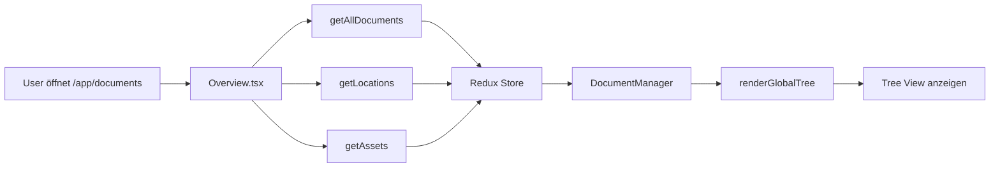

# 🚀 Quick Start - Documents Tree View

## Was wurde geändert?

 **Backend**: Alle Dokumente werden geladen (nicht nur Root-Dokumente)
 **Frontend**: Hierarchie aus Locations → Assets → Dokumente wird gebaut

## Geänderte Dateien (4 insgesamt)

### Backend
1. `api/src/main/java/com/grash/repository/DocumentRepository.java`
2. `api/src/main/java/com/grash/service/DocumentService.java`

### Frontend  
3. `frontend/src/content/own/Documents/Overview.tsx`
4. `frontend/src/content/own/components/DocumentManager.tsx`

## Testen

### 1. System starten
```bash
# Terminal 1: Backend
cd /root/CMMS/api
mvn spring-boot:run

# Terminal 2: Frontend
cd /root/CMMS/frontend
npm start
```

### 2. Browser öffnen
```
http://localhost:3000
```

### 3. Navigation
Sidebar → **Documents** Tab

### 4. Erwartetes Ergebnis
```
cat > /root/CMMS/DOCUMENTS_IMPLEMENTATION_SUMMARY.md << 'EOF'
# 📄 Documents Feature - Implementierungsübersicht

## ✅ Erfolgreich implementiert

### Problem
Der Documents Tab in der Navigation zeigte nur einen einzelnen Ordner an, anstatt eine vollständige Hierarchie aller Locations, Assets und zugehörigen Dokumente.

### Lösung
**Vollständige Hierarchie**: Locations → Assets → Dokumente mit Ordnerstruktur

## 🔧 Technische Änderungen

### Backend (2 Dateien)
```
 repository/DocumentRepository.java
   └── ➕ findByIsActiveTrue()
 service/DocumentService.java
    └── ♻️ getAllDocuments() - gibt nun ALLE Dokumente zurück
```

### Frontend (2 Dateien)
```
 Documents/Overview.tsx
   └── ➕ Lädt Locations & Assets beim Mount
 components/DocumentManager.tsx
    ├── ➕ groupDocumentsByEntityTypeAndId()
    ├── ➕ renderDocumentNode()
    ├── ♻️ renderGlobalTree() - neue Hierarchie-Logik
    └── ➕ Redux Selektoren für locations & assets
```

## 🌳 Tree-Struktur (Vorher vs. Nachher)

### ❌ Vorher
```
Documents
 Ordner 1
```

### Nachher
```
Documents
 Location-Dokument 📄 Location-Dokument 📄 ✅ 📍 Location 1 (Hauptgebäude)
   ├── 📄 Location-Dokument 1
   ├── 🏭 Asset 1 (Kühlanlage)
   │   ├── 📄 Wartungsanleitung.pdf
   │   └── 📁 Technische Daten
   │       └── 📄 Datenblatt.pdf
   └── 🏭 Asset 2 (Lüftung)
       └── 📄 Bedienungsanleitung.pdf
 📍 Location 2 (Lager)
    └── 🏭 Asset 3 (Gabelstapler)
        └── 📄 Sicherheitsdatenblatt.pdf
```

## 🎨 Visuelle Unterscheidung

- **📍 Locations** (Orange): `FolderIcon` mit `color: 'warning.main'`
- **🏭 Assets** (Blau): `FolderIcon` mit `color: 'info.main'`
- **📁 Ordner** (Primär): `FolderIcon` mit `color: 'primary.main'`
- **📄 Dateien** (Grau): `InsertDriveFileIcon` mit `color: 'text.secondary'`

## 📊 Datenfluss



## 🧪 Testing

### Schnelltest
1. System starten: `mvn spring-boot:run` (Backend) + `npm start` (Frontend)
2. Browser öffnen: `http://localhost:3000`
3. Navigation: **Sidebar → Documents**
4. Erwartung: Alle Locations mit Assets und Dokumenten sichtbar

### Detaillierter Test
- [ ] Alle Locations werden angezeigt
- [ ] Assets sind unter korrekter Location gruppiert
- [ ] Location-Dokumente sind direkt unter Location sichtbar
- [ ] Asset-Dokumente sind unter Asset sichtbar
- [ ] Ordner-Hierarchie funktioniert (verschachtelte Ordner)
- [ ] Download-Button funktioniert für Dateien
- [ ] Löschen-Button funktioniert (mit Berechtigung)
- [ ] Tree lässt sich auf-/zuklappen

## 📝 Code-Qualität

### ✅ Best Practices befolgt
- Wiederverwendung bestehender UI-Komponenten
- Separation of Concerns (Backend gibt Daten, Frontend baut Hierarchie)
- Type-Safety (TypeScript Interfaces)
- Performance-Optimierung (Gruppierung mit reduce)
- Rückwärtskompatibilität (Entity-spezifische Ansichten funktionieren weiter)

### ⚠️ Bekannte Einschränkungen
- Assets ohne Location werden nicht angezeigt
- Parts (Teile) haben keine eigene Hierarchie-Ebene
- Bei >1000 Dokumenten könnte Performance-Optimierung nötig sein

## 🚀 Nächste Schritte

### Priorität HOCH
1. **Manueller Test** nach System-Start durchführen
2. **Bug-Fixes** falls Probleme auftreten

### Priorität MITTEL
3. **Parts-Hierarchie** hinzufügen (Location → Asset → Part → Dokumente)
4. **"Unassigned" Ordner** für Assets ohne Location

### Priorität NIEDRIG
5. **Filter & Suche** implementieren
6. **Lazy Loading** für Performance
7. **Leere Knoten ausblenden** Option

## 📚 Weitere Dokumentation

Siehe `DOCUMENTS_FEATURE_CHANGES.md` für detaillierte technische Informationen.

---

**Status**: ✅ Implementierung abgeschlossen  
**Letzter Test**: Ausstehend (manuell nach System-Start)  
**Geänderte Dateien**: 4 (2 Backend, 2 Frontend)
